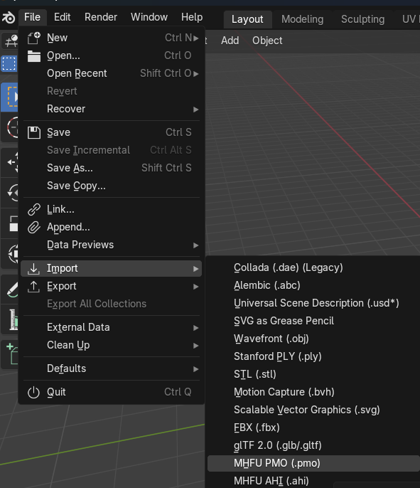
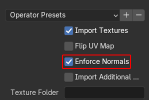
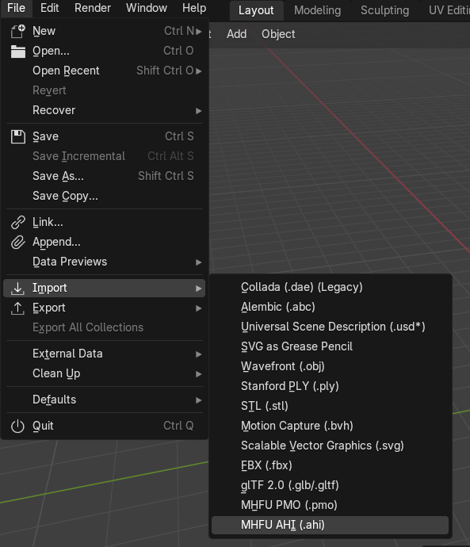
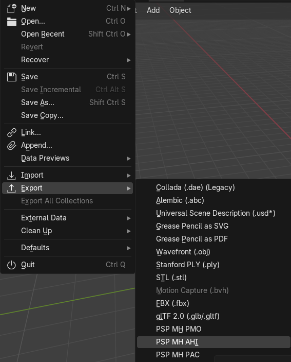
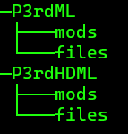

# Monster Hunter Portable 3rd Modding Guide

This guide aims to give some info about game files, and how to modify some of them. The guide will be heavily centered around modifying game models specifically, throughout the entirety of the guide, I will use and mention files from the original PSP release, and not for the PS3 HD re-release. The guide and tools mentioned, should still prove helpful to anyone trying to modify HD version files and Freedom Unite.

* For Freedom Unite/P2G I'd recommend to use [FUComplete](https://fucomplete.github.io/) in order to extract the files, as that would result in a file tree rather than unorganized numbered files.

## The guide

### `DATA.BIN`

All of the game files are contained in a single `DATA.BIN` file in the ISO. So, to access any individual files, one must first access the `DATA.BIN` file, decrypt, and extract it's contents.

WinRAR, UMDGen or any other software that can access the contents of an ISO file may be used for this purpose.

The file within the ISO is located at `PSP_GAME/USRDIR/DATA.BIN`.

#### Decrypting and extracting

To decrypt and extract the files within `DATA.BIN`, [mhtools](#tools) must be used.

* [mhtoolsgui](#tools) is a GUI version of [mhtools](#tools)
* Java is required for both.

Using the CLI version of mhtools, files can be extracted and decrypted by running the following command in the same directory as `mhtools.jar` and `DATA.BIN`. `DATA_BIN` is the destination folder for all the files extracted.

    java -jar mhtools.jar --dec-all DATA.BIN DATA_BIN

### Finding files

Files within `DATA.BIN` are not named, nor in any folder structure. Extracting them will just give you numbered files. You could check every file to see if it contains what you may be looking for. But if you specifically want hunter assets, a list with almost all of them (missing clothes at the moment) can be found [here](https://github.com/Kurogami2134/MHP3rd-Game-FIle-List/).

### Extracting contents

There are multiple files, in multiple file formats within `DATA.BIN`. Some of them are compiled game code, some are sound, some are quests, some are textures, etc. [mhtools](#tools) can extract some of those formats given you use the correct [decoder number](#glossary). 

#### Some formats

|Extension|Content|info|
|-|-|-|
|pmo|Model data|pmo files are not directly in the `DATA.BIN` file, but contained in package (pak/pac) files|
|pak|Anything|pak or pac files, are essentially archived folders, and can contain any number of files with different formats|
|tmh|Textures||
|mwo|Game code||
|mib|Quest data||
|bin|Anything|bin files are just binary files that can contain anything, from game dialogue to sound|
|head|Sound headers|head files are accompanied by bin files that contain the actual sound data|

### Modding models

Models in the game, are stored within [pak/pac](#some-formats) files. Different types of models may contain different files in their pacs. Monster models for example, often contain more than a single model, having an additional model for projectiles. P3rd helmet model pacs, contain an additional file that specifies info about physics and which part of a hunter's face should be rendered while wearing them.

For the rest of the guide I'll use, and assume you're using, weapon models, the structure remains the same for most pieces of equipment, weapons and armor (except for P3rd helmets). So this should not be a problem.

#### pac contents (usually)

This are the contents of the pac containing Yukumo SnS (Yukumo Saber in game) model, as extracted by [mhtools](#tools)

|File|Info|
|-|-|
|000_data.pmo|This is the actual model data, this contains material and vertex data for the model|
|001_data.bin|This bin file, from now onwards `ahi`, contains skeletal data for the model|
|002_image.tmh|Contains the textures the model uses|

#### Accessing files

##### Textures

[mhtools](#tools) will automatically extract the contents of [tmh](#some-formats) files. So accessing textures should be no problem, they will be converted to png format, and the file name will specify info about the image.

##### Skeletal and model data

Both `ahi` and `pmo` files can be loaded into [Blender](#tools) using [*&](https://github.com/AsteriskAmpersand)'s [PMO Importer Add-on](https://github.com/AsteriskAmpersand/PMO-Importer).

###### Model data

pmo files, containing model data, can be imported into Blender by going to
`File > Import > MHFU PMO (.pmo)` on the top bar.

If importing P3rd models you should check `Enforce Normals` on the operator settings. To avoid issues caused by the differences in the format used by both games (FU and P3rd).

###### Skeletal data

bin files, containing skeleton data, can be imported into Blender by going to
`File > Import > MHFU AHI (.ahi)` on the top bar. [PMO Importer](#tools) will only let import `.ahi` files, so you should rename them to have that extension.

##### 003_data.bin on P3rd helmets

This file contains only 8 bytes worth of data. And you probably shouldn't try to read it. But if you do, the contents are something like the following:

|Data type|Info|
|-|-|
|Unsigned short|Face flags or-ed together|
|Unsigned short|Hair flags or-ed together|
|Integer|Index to an entry in a physics table (probably, didn't really check)|

#### Modifying files

Just seeing models and textures is ok, but putting some new ones in the game is our goal here.

##### Textures

If you extracted a pac file using [mhtools](#tools) you can edit the textures in any image manipulation software. You'll need to respect some limitations, mainly a maximum color count (usually 256, sometimes 16), and a pixel format (5551, 4444, 5650, 8888).

These limitations can be avoided if [exporting full pacs from blender](#full-pac-export).

##### Skeleton data

If you have a skeleton (made from empties) with the appropriate data (id for P3rd, id and ik chain for FU), you can export it from blender by going to `File > Export > PSP MH AHI`on the top bar:

##### Model data

A model correctly set up can be exported using the `File > Export > PSP MH PMO` option in Blender's top bar.

In order to be exported, a model needs to be fully rigged and have at least one material.

Vertex groups/rigs must have `.XXX`, with `XXX` being the bone id, as a suffix in their names.

Materials should have `_XXX`, with `XXX` being the material id, as a suffix in their names. If you're only exporting a single mesh, with a single material, you can name it whatever you want.

All models must have triangulated faces only, and uvs may need to be split for exports to work, a script made by [Xenthos](https://github.com/Xenthalos) is included as an option in vertex data, and as a toggle on export. That should prepare custom meshes to be exported correctly. It may break original models.

All materials can be edited to have custom `Diffuse` and  `Ambient` values, as well as overriding their texture index (in case of using textures in Blender)

Additionally, PMO export supports features not used by the game, as [Backface Culling](#glossary), [Custom texture filters](#glossary) and [Alpha blending](#glossary).

To use those features, custom attributes and/or object properties must be added in Blender.

Object properties:

|Property|Values|
|-|-|
|PMO Alpha Blending Params|0 to 255|
|PMO Light Distance Attenuation Factor|0 to 255|

The following are the currently working mesh attributes:

|Atribute|Info|Values|
|-|-|-|
|PMO Backface Culling|Enable or disable backface culling|0 or 1|
|PMO Alpha Test Enable|Enable or disable alpha blend|0 or 1|
|PMO Texture Filter|Set custom texture filters|XY, X being minification filter, and Y magnification filter. Both X and Y must be a texture filter, and a texture filter attribute or-ed together|
|PMO Shade Flat||0 or 1|

* All these attributes must be set as integers, and per face.

###### Texture filtering options

|Filters|Value|
|-|-|
|Nearest|0|
|Linear|1|

|Attributes|Value|
|-|-|
|Mipmap nearest|4|
|Mipmap linear|6|

##### Full pac export

[PMO exporter addon](#tools) also has an option to export a full pac, containing a single skeleton, a single model, and a single set of textures (optionally, a P3rd helmet's info as well). By clicking on `File > Export > PSP MH PAC`, you can export everything as a single file that should work without any extra work.

When exporting full pacs, textures must be assigned to materials on Blender's `Shading` tab, and may have up to 256 colors in any case. PMO export will use the best suited pixel format, to avoid huge files, but allow to use transparent textures if needed.

#### Loading new files

When it comes to loading your edited or even created files, you have two options: patching, or using a mod loader.

##### P3rd patching

Using the following command, one can create a patch to be used with [p3rd-patcher](#tools) in order to permanently install mods.

    java -jar mhtools.jar --create-patch <files> MHP3RD_DATA.BIN

`files` must be a `space` separated list of files to include in the patch.

To then patch the iso use this command:

    patcher.exe MHP3RD_DATA.BIN MHP3.ISO

##### P3rd mod loader (using [mhp3reload](#tools))

Using [mhp3reload](#tools) and the included mods, you can replace files at runtime without having to patch the ISO every time.

If we wanted to replace Yukumo Saber, with a custom model, we should rename our pac file to `0601` and place it in `ms0:/P3rdML/files/0601` (if you want to replace another model look for it in the [weapon model list](https://github.com/Kurogami2134/MHP3rd-Game-FIle-List/blob/main/weapons.md)).

`ms0` is the root of the memory stick on a real PSP. For PPSSPP you can either use the `memstick` folder for portable, or `PPSSPP` folder for installs. (if you're not sure, it's the one that contains `PSP/SAVEDATA`, so two dirs up from `SAVEDATA`)

You can refer to [Installing mhp3reload](#installing-mhp3reload) if you don't know how to install it.

##### FU mod loader (using [FUComplete](#tools))

Information on how to set up FUComplete can be found at the project's [site](https://fucomplete.github.io/docs/setup.html).

And info on how to use it to replace files can be found [here](https://fucomplete.github.io/docs/fuctool/file_replacer.html).

### Installing mhp3reload

First get the latest release, either from [Github](https://github.com/Kurogami2134/mhp3reload_hd) (for [HD version](https://github.com/Kurogami2134/mhp3reload_hd)) or [Gamebanana](https://gamebanana.com/mods/543059).

Then get any IPS patcher, you can get [LunarIPS](#tools) from the tools section.

Make a backup of your ISO, and apply the patch that came with the release.

Then extract the `rar` file that came with it to the root of your memory stick, or your `PPSSPP` folder (`memstick` on portable installs). You should get a file structure that looks like this. (You only need the tree for the version you're trying to install)

### Editing sounds

Using [audiotools](#tools) you can extract and rebuild sound files, this has not been tested thoroughly so the information may not be accurate for every sound in the game, not even for every hunting horn, were it's been tested.

#### audiotools

There's a few options that can be used with the python module to work with game files.

The way to use it is in commands formatted like this

    py -m audiotools <option> <target>

Different options may have different requirements for `target`, like having two different files.

##### Options

- extract:
    Extracts the sounds from a file/s to a folder in your working directory.
    target: Either a single file that contains full data, or two files being header, and sound data

- rebuild:
    Rebuild sound files from a folder. Folder must contain files as formatted by extract
    target: A folder containing:
        - HEAD.BIN
        - TRACKS.TXT
        - Any number of files containing 16bits ADPCM named `SNDXX.RAW`

- decode:
    Convert a single `.RAW` 16bits ADPCM file to `WAV`
    target: a `.RAW` file, a `.WAV` output file

- ex-decode:
    Extract the sounds from a file/s to a folder in your working directory, and convert them to `.WAV`.
    target: Either a single file that contains full data, or two files being header, and sound data

- encode:
    Convert a single 16bits PCM `.RAW` or `.WAV` file to 16bits ADPCM `.RAW`
    target: either a `.WAV` or `.RAW` file, a `.RAW` output file
    * Encode is way lossier than it needs to be, and so it's not recommended to use it if there are better alternatives. Windows users can use [MFAudio](#tools) as a better alternative for this part of the process.

#### Loading sound files

You can load sound files as you would any other as explained in the [Loadin new files](#loading-new-files) section. In case of using [mhp3reload](#tools). You need to convert from the number name generated by [mhtools](#tools) to it's hex id. Just subtract 1 and convert to hex, all caps, always using 4 digits. So `2470` for example would be `hex(2469)` or `0x9a5`, so your file should be named `09A5`.

### Using custom animations

[This repo](https://github.com/Kurogami2134/mhp3rd-wpn-anim) contains python code to generate custom animations, and animation entries, which will work both on FU and P3rd. As well as `assembly` code to build (use [armips](#tools)) a mod to load them, only in P3rd (no hd) currently.

#### Creating animations

Custom animations are quite limited, you only get 6 "[keyframes](#glossary)", and those are fixed in the game. For example for GS you can only use

- Sheathed
- Unsheathed
- Attacking
- Charge 1
- Charge 2
- Charge 3

The python code will create an animation pack based on the `included.json` file.

The file should contain filenames, without the `json` extension, as keys, and as values the id of the model they're supposed to be used on. The files referenced in this file must be in an `animations` folder in your directory and be structured in the format specified in the [next sessions](#animation-format).

##### Animation format

Animations files have 3 keys:

- `type`: Lowercase abbreviation of the weapons name
- `texture` and `model`: lists of `animations`

Animations have 3 keys as well:

- `type`: One of the animation types included in the repo (still a WIP)
- `bone`: The bone/joint to be affected by the animation. In texture animations it appears to be the object within the pmo and no be tied to rigs nor materials.
- `keyframes`: A list with 6 elements, values for the animation on each of the available keyframes. These values vary for animation to animation, and some vary between FU and P3rd (for example, `SCALE` is actually `SCALE_UP` in FU, so where a value of `0` would make a mesh turn into a point, but in FU it would have no effect)

The following example is the animation files for a Great Sword, of which the bone with id 3 increases in size when charging slash. As it has scale `0` is not visible by default, but only while charging. The animation can be seen in [this video](https://youtu.be/FLqdkkF1vkQ).

    {
        "type": "gs",
        "texture": [

        ],
        "model": [
            {
                "type": "SCALE",
                "bone": 3,
                "keyframes": [
                    0,
                    0,
                    0,
                    272,
                    288,
                    336
                ]
            }
        ]
    }

This example, on the other side, is for a Sword and Shield that has a texture sliding horizontally to create a "glowing" effect. The animation can be seen in [this video](https://www.youtube.com/watch?v=P4-6atzWG8w).

    {
        "type": "sns",
        "texture": [
            {
                "type": "H_STRIDE",
                "bone": 2,
                "keyframes": [
                    48,
                    48,
                    48,
                    48,
                    48,
                    48
                ]
            }
        ],
        "model": [
            
        ]
    }

#### Loading custom animations

In order to load custom animations both `spanimexp.bin` (the mod that makes the game use custom animations), and `spanimpak.bin` (the animation package generated from the `json` files) must be enabled as mods in `mods.bin`.

## Glossary

(Most stuff here is directly out of Wikipedia, I'm just adding stuff some people may not understand, but if you're here you probably know these things)

- mhtools `decoder number`:
    mhtools can extract and rebuild many of the file formats used in the game. But it won't recognize them by itself, you need to use a `decoder number` to specify what kind of file you're working on. [mhtools repository's README file](https://github.com/codestation/mhtools/blob/master/README) contains a list of which `decoder number` should be used for each format.
- Texture filtering:
    Texture filtering is the method used to determine the texture color for a texture mapped pixel, using the colors of nearby texels (ie. pixels of the texture).
- Back-face culling: 
    Back-face culling is a graphics optimization technique used to enhance rendering efficiency in 3D computer graphics by discarding polygons whose back faces are not visible to the viewer.
- Alpha blending:
    Alpha blending is the process of combining one image with a background to create the appearance of partial or full transparency.
- Keyframes:
    In animation and filmmaking, a key frame (or keyframe) is a drawing or shot that defines the starting and ending points of a smooth transition

## Tools

- [mhtools](https://github.com/codestation/mhtools)
- [mhtoolsgui](https://github.com/EclipseKnight/mhtoolsgui)
- [Blender 4.2](https://www.blender.org/download/releases/4-2/)
- [PMO Importer Add-on](https://github.com/AsteriskAmpersand/PMO-Importer)
- [PMO export Add-on](https://github.com/Kurogami2134/pmo_export)
- [FUComplete](https://fucomplete.github.io/)
- [mhp3reload](https://github.com/Kurogami2134/mhp3reload)
- [mhp3reload_hd](https://github.com/Kurogami2134/mhp3reload_hd)
- [p3rd-patcher](https://gamebanana.com/tools/10719)
- [lunarIPS](https://www.romhacking.net/utilities/240/)
- [audiotools](https://github.com/Kurogami2134/p3rd-hh-song-editing)
- [MFAudio](https://www.zophar.net/utilities/ps2util/mfaudio-1-1.html)
- [p3rd-wpn-anim](https://github.com/Kurogami2134/mhp3rd-wpn-anim)
- [armips](https://github.com/Kingcom/armips)

## Other links

- [Game file list](https://github.com/Kurogami2134/MHP3rd-Game-FIle-List/)
- [MHP3rd Mods at Gamebanana](https://gamebanana.com/games/17251)
- [MHFU Mods at Nexus Mods](https://www.nexusmods.com/monsterhunterfreedomunite)
